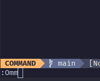
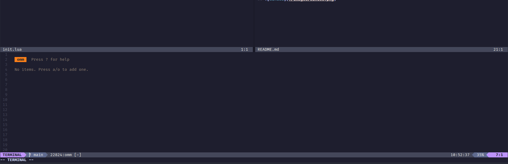

<h1 align="center">
    omm.nvim
</h1>

<p align="center">
    nvim integration for <a href="https://github.com/dhth/omm">omm</a>"
</p>

## Requirements

- [omm](https://github.com/dhth/omm)
- omm executable in your PATH

## Installation

### Lazy

```lua
return {
  "davitostes/omm-nvim",
  config = function()
    require("omm-nvim").setup()
  end,
}
```

### Using

Adds the command `Omm` to open omm in a floating window.




